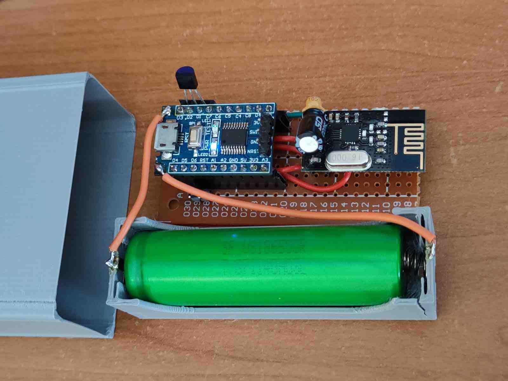

Small project of creating wireless temperature sensor. Include: creating board, writing code for stm8 in C with SPL lib, writing custom driver for ds18b20 sensor, adapting some library for nrf24 in stm8 platform, cutting some code beacuse of only 8KB flash, writing script in python for raspberry pi to receive paylods end send to mqtt server with chart support, crating service in systemd.

